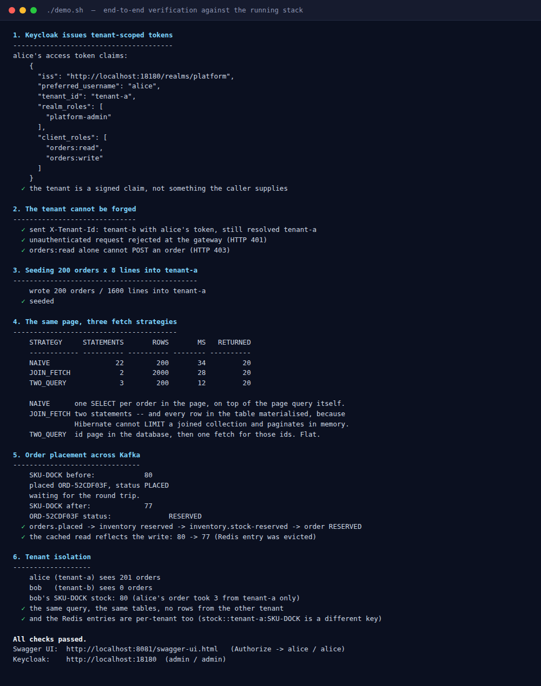
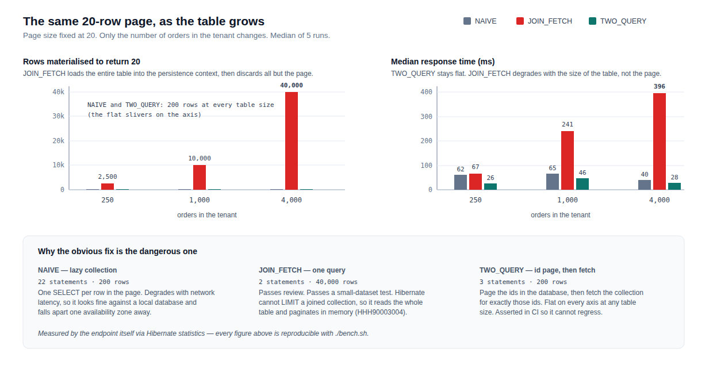
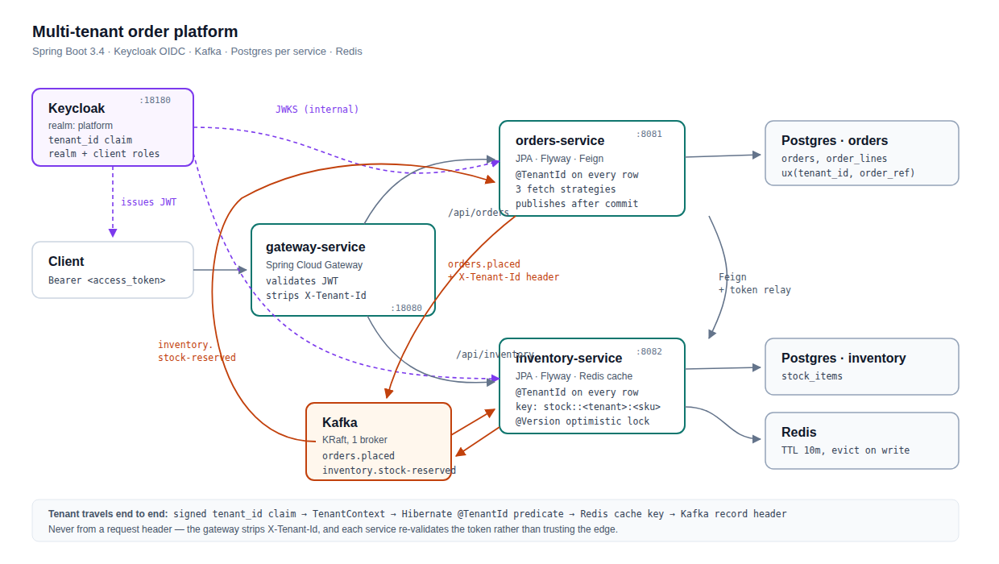
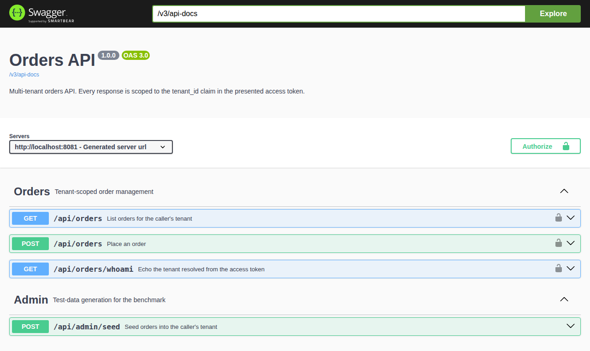

# Multi-tenant Spring Boot microservices — Keycloak, Kafka, Postgres, Redis

A working reference implementation of the stack most Java backend teams actually run:
Spring Boot 3.4 services behind a gateway, Keycloak for OIDC, Kafka between them, Postgres
per service, Redis for cached reads, all on Docker Compose with a CI pipeline.

It is built around **three defects that this architecture produces by default**. Each one is
reproduced, measured, and fixed in the code — because a repository that only shows the happy
path tells you nothing about whether the author has debugged this stack at 2am.

| | The defect | Where it hides | Fix |
|---|---|---|---|
| 1 | **N+1 on a paginated listing** | 22 queries instead of 3 — invisible until the table grows | [`OrderRepository`](orders-service/src/main/java/dev/yuvaraj/reference/orders/repo/OrderRepository.java) |
| 2 | **Cross-tenant reads** | every test passes, because they all use one tenant | [`TenantConfig`](orders-service/src/main/java/dev/yuvaraj/reference/orders/config/TenantConfig.java) |
| 3 | **Cross-tenant cache keys** | Redis has no idea `@TenantId` exists | [`RedisCacheConfig`](inventory-service/src/main/java/dev/yuvaraj/reference/inventory/config/RedisCacheConfig.java) |

```bash
make up      # build jars, start the stack, wait for health
make demo    # prove all of the above, end to end
```



*Every assertion above runs against the real stack — Keycloak, Kafka, Postgres and Redis in
containers — and `demo.sh` exits non-zero if any of them fails. It runs on every push in CI.*

---

## 1. The N+1 that survives its own fix

`GET /api/orders` returns orders with their lines. The endpoint reports what each request
cost, so the comparison is a number rather than an argument:

```
STRATEGY     STATEMENTS       ROWS       MS   RETURNED
NAIVE                22        200       62         20
JOIN_FETCH            2       2500       67         20
TWO_QUERY             3        200       26         20
```

Most write-ups stop at "add `join fetch`". That is the middle row, and it is a **worse** bug
than the one it replaces — Hibernate cannot apply `LIMIT` to a joined collection without
losing rows, so it fetches the entire result set and paginates in application memory
(`HHH90003004`). Two statements, and the whole table in the persistence context.



It gets worse in exactly the way that does not show up in review:

| Orders in tenant | NAIVE | JOIN_FETCH | TWO_QUERY |
|---:|---:|---:|---:|
| 250 | 200 rows / 62ms | 2,500 rows / 67ms | 200 rows / 26ms |
| 1,000 | 200 rows / 65ms | 10,000 rows / 241ms | 200 rows / 46ms |
| 4,000 | 200 rows / 40ms | **40,000 rows / 396ms** | 200 rows / 28ms |

Forty thousand rows materialised to return twenty. `TWO_QUERY` — page the ids in the
database, then fetch the collection for exactly those ids — is flat on every axis at any
table size. Full data in [`results/results.md`](results/results.md), regenerate with
`./bench.sh`.

The cost is asserted in CI, so it cannot silently regress:

```java
assertThat(page.jdbcStatements()).isLessThanOrEqualTo(3);   // TWO_QUERY
assertThat(page.rowsMaterialised()).isLessThan(joinFetch.rowsMaterialised());
```

## 2. Tenant isolation that does not depend on remembering

Tenancy is a Hibernate `@TenantId` discriminator resolved from the validated JWT, never a
method parameter:

```java
Page<OrderEntity> findAllByOrderByPlacedAtDesc(Pageable pageable);   // no tenant argument
```

There is nowhere to pass the wrong tenant, because nothing accepts one. Hibernate appends the
predicate to every statement it generates — including hand-written JPQL, which is how this
usually gets lost:

```java
// tenant A explicitly asking for tenant B's rows, by name
entityManager.createQuery("select count(o) from OrderEntity o where o.orderRef like 'B-ORDER%'")
// -> 0
```

An unbound thread resolves to a sentinel that matches no tenant, so a background job that
forgets to bind one returns **nothing** rather than **everything**. Failing closed is the only
safe default: an empty list gets investigated, a full one gets shipped.

The tenant claim is signed. Sending `X-Tenant-Id: tenant-b` alongside tenant-a's token changes
nothing, and the gateway strips the header anyway:

```
✓ sent X-Tenant-Id: tenant-b with alice's token, still resolved tenant-a
```

## 3. The cache that `@TenantId` cannot protect

A Redis cache on a multi-tenant read is a second copy of the data that never goes through
Hibernate. Cache under `stock::SKU-DOCK` and tenant B is served tenant A's numbers on a hit —
a leak no amount of reviewing the repository layer will catch, and one that passes every test
written against a single tenant. The key is `stock::<tenant>:<sku>`, and the read and its
eviction share one expression so they cannot drift apart:

```java
private static final String TENANT_SKU_KEY =
        "T(dev.yuvaraj.reference.security.TenantContext).requireTenant() + ':' + #sku";
```

That detail is not cosmetic. A `KeyGenerator` deriving the key from method arguments produces
`tenant:SKU-DOCK` for `getStock(sku)` and `tenant:SKU-DOCK:3` for `reserve(sku, quantity)` —
the eviction deletes a key that was never written, nothing fails, and the stale value survives
until the TTL expires.

---

## Architecture



```
Keycloak ──issues JWT (tenant_id claim)──┐
                                         v
client ──> gateway :18080 ──> orders-service :8081 ──Feign──> inventory-service :8082
           (validates,       (Postgres "orders")              (Postgres "inventory", Redis)
            strips               │                                    ^
            X-Tenant-Id)         └──orders.placed──> Kafka ───────────┘
                                          inventory.stock-reserved
```

**Why the services validate the token again behind the gateway.** Anything that can reach
port 8081 directly could otherwise claim any tenant by setting a header. The gateway is a
routing and throttling point, never the only place authorization happens.

**Why the gateway does not share `common-security`.** It is WebFlux; the shared module
registers a servlet filter and a `ThreadLocal`. On a Netty event loop, where one thread serves
many requests, that compiles cleanly and leaks tenants under load.

**Why event contracts are duplicated instead of shared in a jar.** A shared model makes every
consumer a compile-time dependency of the producer — four services redeployed to add one
optional field. The cost is a hand-maintained copy per side; the benefit is independent
deploys.

**Why publication is deferred to `afterCommit`.** Sending inside the transaction is the common
shape and it races: the consumer can receive the event, call back for the order, and find
nothing, because the producing transaction has not committed. Deferring trades that race for
an at-most-once gap — and marks the point where a real system reaches for a transactional
outbox.

Longer treatment of each decision, including the ones deliberately left unsolved, in
[`docs/architecture.md`](docs/architecture.md).

## Running it

Requires Docker, and JDK 17+ with Maven for the build.

```bash
make up       # mvn package, docker compose up --build, wait for health
make demo     # the full end-to-end proof
make bench    # regenerate results/results.md
make test     # unit + Testcontainers integration tests
make down     # tear down, including volumes
```

| | URL | Credentials |
|---|---|---|
| Orders Swagger UI | http://localhost:8081/swagger-ui.html | Authorize → `alice` / `alice` |
| Inventory Swagger UI | http://localhost:8082/swagger-ui.html | as above |
| Keycloak admin | http://localhost:18180 | `admin` / `admin` |
| Gateway | http://localhost:18080 | bearer token required |



The Swagger UI "Authorize" button runs a real authorization-code flow with PKCE against the
running realm, so the whole thing can be exercised from a browser without touching a terminal.

Host ports are unusual on purpose (Keycloak on 18180, gateway on 18080, Postgres on 15432) so
the stack does not collide with anything already running. Override with `KEYCLOAK_PORT`,
`GATEWAY_PORT`, etc.

Realm users, all seeded from [`infra/keycloak/platform-realm.json`](infra/keycloak/platform-realm.json):

| User | Password | Tenant | Roles |
|---|---|---|---|
| `alice` | `alice` | tenant-a | `platform-admin`, `orders:read`, `orders:write` |
| `bob` | `bob` | tenant-b | `platform-admin`, `orders:read`, `orders:write` |
| `readonly` | `readonly` | tenant-a | `orders:read` |

## Tests

```
KeycloakJwtAuthenticationConverterTest   6 tests   no Docker required
TenantIsolationTest                      5 tests   Testcontainers Postgres
FetchStrategyTest                        4 tests   Testcontainers Postgres
CacheTenantIsolationTest                 3 tests   Testcontainers Postgres + Redis
```

Real Postgres, not H2. The behaviour under test *is* Hibernate's generated SQL — tenant
predicates, `LIMIT` placement, how `join fetch` interacts with pagination. An in-memory
database in compatibility mode is a different dialect wearing a costume, and it hides
precisely these differences.

`mvn -Pno-docker test` runs only the tests that need no daemon.

## Four things that cost real time to get right

Each of these produces a symptom that points somewhere unhelpful.

**Keycloak 24+ silently drops unknown user attributes.** Add `tenant_id` to a user, map it to
a claim, and the claim is simply absent — no error anywhere. The realm's user profile needs
`unmanagedAttributePolicy: ENABLED`, or the attribute must be declared. Both are in
[`platform-realm.json`](infra/keycloak/platform-realm.json).

**Keycloak derives `iss` from the address it was reached at.** A token minted through
`localhost:18180` and a service validating against `http://keycloak:8180` disagree, and every
request returns 401. Fixed by pinning `KC_HOSTNAME` and splitting the two properties: the
issuer is *compared*, the JWKS URI is *dialled*.

```yaml
issuer-uri:  http://localhost:18180/realms/platform                            # in the token
jwk-set-uri: http://keycloak:8180/realms/platform/protocol/openid-connect/certs # reachable
```

**`@Transactional` on a method the same bean calls does nothing.** It is applied by a proxy,
so self-invocation bypasses it entirely — the annotation reads as if it works. The Kafka
listener therefore delegates to a separate `OrderStatusUpdater` bean.

**Records break `GenericJackson2JsonRedisSerializer`.** Records are final, so Jackson's
`NON_FINAL` default typing writes no `@class` property and then demands one on read. The cache
writes fine and every *hit* fails — never reproducible locally against an empty cache. A
serializer bound to the concrete type fixes it, and removes a deserialization gadget as a side
effect.

## What this deliberately does not do

Stating the gaps is more useful than implying there are none.

- **No saga or outbox.** A rejected order can still have consumed stock from earlier lines.
  The comment in `OrderPlacedListener` says so explicitly. Fixing it properly means a
  compensating release or a single transaction across lines — a design decision, not an
  oversight to paper over.
- **No Kubernetes manifests.** Compose is honest about what this is: a reproduction, not a
  deployment.
- **`platform-cli` is a public client with password grant.** Fine for a scripted local demo,
  wrong for production, where an interactive flow with PKCE belongs.
- **Single Kafka broker, replication factor 1.** Any higher never becomes available on one
  node and the first producer send hangs until it times out.

## Layout

```
common-security/     Keycloak JWT -> authorities, tenant propagation (Spring auto-configuration)
gateway-service/     Spring Cloud Gateway, WebFlux, edge JWT validation
orders-service/      Postgres, JPA, Kafka producer + consumer, Feign client, the N+1 comparison
inventory-service/   Postgres, Redis cache, Kafka consumer + producer
infra/               Keycloak realm, Postgres init, Dockerfile
demo.sh              end-to-end proof
bench.sh             scaling measurements -> results/results.md
```
